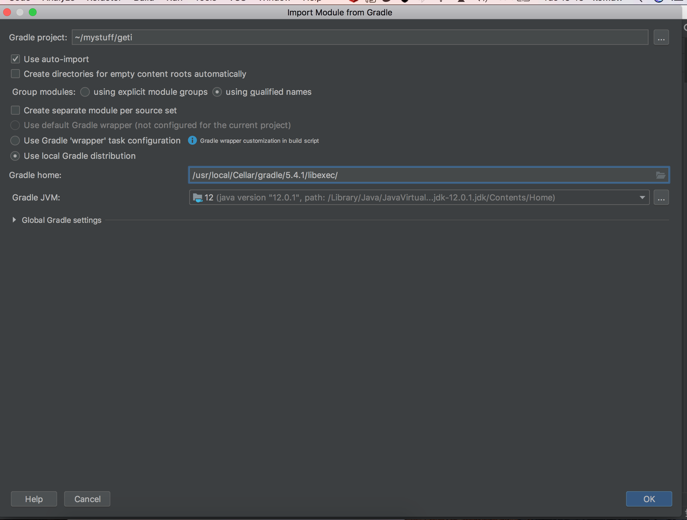
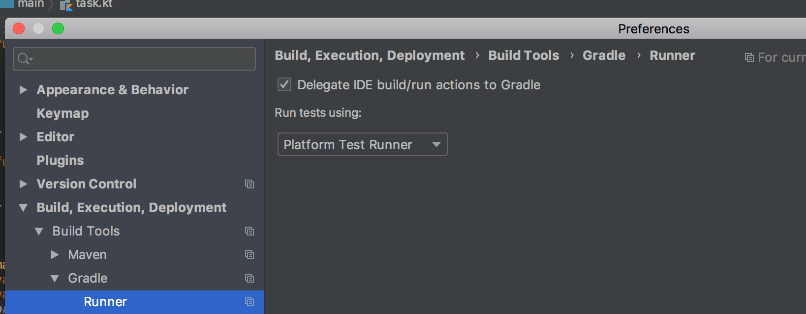

## geti


`geti` is an asynchronous distributed task processor.       
It's name is derived from the Kenyan hip hop artiste, Johnny Vigeti.    

It is a bit like [Celery](https://github.com/celery/celery) or [Resque](https://github.com/resque/resque)      

`geti` is work in progress and very early. It's API may change in backward incompatible ways.


#### build
```bash
gradle build
java -jar build/libs/geti.jar
```


